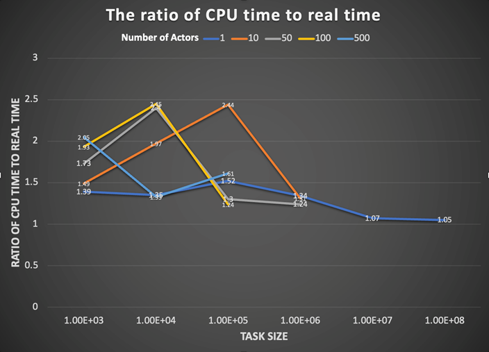
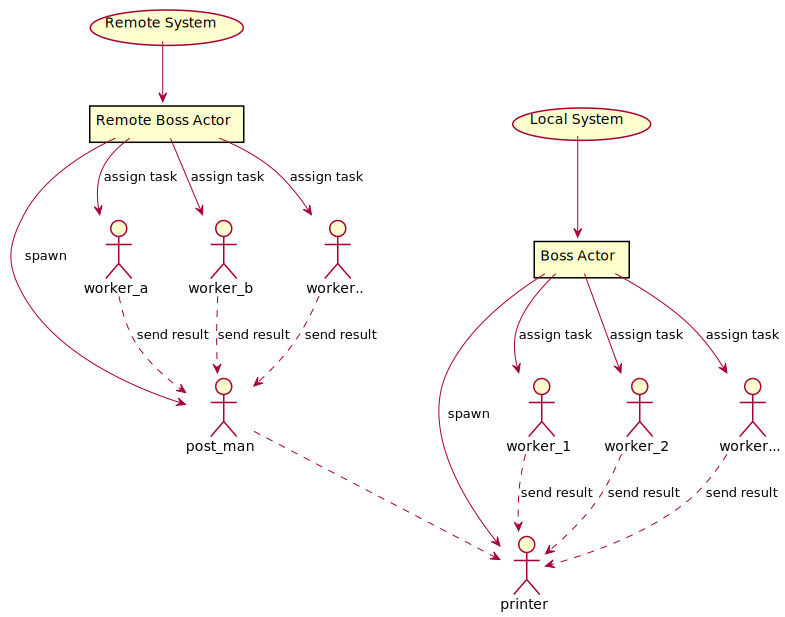
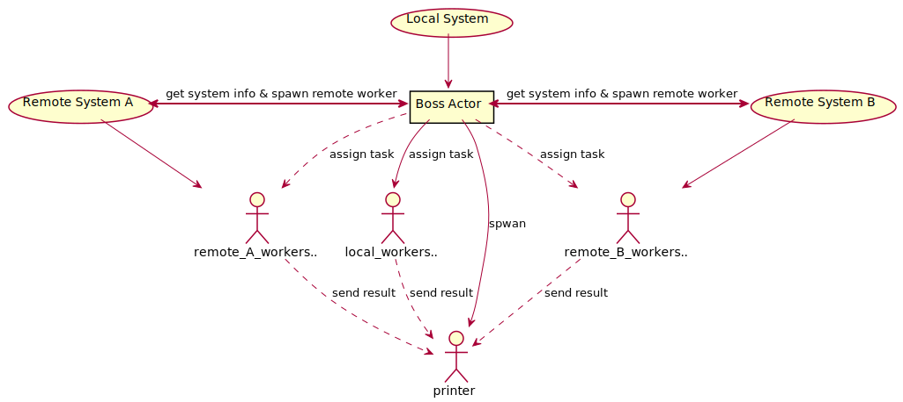

# Distributed Operating System Projects 1
This project implemented distributed computing systems based on actor model with F# and Akka.NET to handle intense computational tasks. To simulate high-intensity computaional tasks, the project takes reference from the Bitcoin's concept of finding some input string whose output values matches a specefic pattern after a cryptographic hashing computation.
## Problem Definition
Given a string, use SHA-256 to produce a hash value. Check if the heading part of the hash value contains a specefic number of consecutive zeros. Only the string's hash value that matches the rule are considered valid. The higher the number of zeros, the more difficult it is to find a valid string.

For example:   
An input string,"hongru.liu;jrs", gives a SHA- 256 hash value of "000000E9EF6A44DC2F5BA00873909A682032E9329FB29C95FE199482B352B923", which matches with the rule of six zeros.

* All of the input string are starting with "hongru.liu;" to ensure their specificity. It cna be omitted or replaced with any string.

## Part 1 - String Generation and Validation

**Input:** The number of leading zeros required for a valid SHA256 string

**Output:** \<Input string>&nbsp;&nbsp;&nbsp;&nbsp;&nbsp;&nbsp;\<Corresponding SHA256 hash>
### File Path
```
./part1/PrintValidStrings.fsx
```
### Usage
```Console
dotnet fsi .\PrintValidStrings.fsx <zero number>
```
### Algorithm
1. The progeram takes decimal numbers as input and convert them to 62 decimal representation according to a dictionary consisting with numbers, lowercase letters and uppercase letters in order.
2. Concatenate a specified string to the front of the convertered string
3. Generate SHA-256 hash of the string by using System.Security.Cryptography library.
4. Match the number of heading zeros of the hash string
5. Add valid string into a list, and return the list when finished 
### Performance
* Due to the nature of this single-thread progrom, the average ratio of CPU time to absolute time for the experiences with zero number from 0 to 4 is close to 1, which is **0.93**. The reason of why absolute time is longer than CPU time can be considered as the extra time for printing results or unnecessary waiting time happened during program running. 
### Selected Results
#### **1 Zeros**
```
hongru.liu;fs   0FF09B8ECD6FD787700FAC886BAB7FAA4B9B3FC04246D023F8746973F3C46CCC
hongru.liu;fz   037C68001F5EB801ACACB594D83D6DD2FA48EE469A72DBECAA5EFD6860479BB5
hongru.liu;fR   02B8FBA14D362FFC11527F66394A98FA53C16D718F5BA132E465D62726AF6F98
hongru.liu;fY   0725A102DC2AC162C630E383DD6E3424FE3AF9452A2AF5C673F593BB7E9D21CA
hongru.liu;g6   092EBAC7CAEBBAE47248261DAB19A4A8F4BFB645EF7E76D8F9C23CFB98395D74
```
#### **2 Zeros**
```
hongru.liu;2bb  0058169C99AACE5080C3B64938D23C7D4C3F442A9EAB8325D7F3B9997FD9C95B
hongru.liu;2bk  005863F495C5BA79CA2E4B4DDD84A9853B592E06742A1F0626B31B88FD5ADB5E
hongru.liu;2fT  00B2EF42E9E9E3539AA7FDEAFC4553D73A5D874A0048BB2E0BB10DD01A3113F0
hongru.liu;2oi  0063DD63ADD74AF744D09A746DE63BCD58B854265B1FAD5DE9B2F76122FA9FAC
hongru.liu;2wk  00B8F489D975EA4342BD9065FB340D5491FEF290B70CE668A77830D085ED18DD
```
#### **3 Zeros**
```
hongru.liu;iJ8  00022B0E3F9E3C6C8207DAE63BACD487B82366FCBB97ED15F5338CB09980C38F
hongru.liu;kr1  000994E873E5BE9394C91E99FBCA34BF5F6BB640A1CE92AE72BFB8185C056D49
hongru.liu;nE2  000C2299097DF0FA25F247AFE2B75A08EF3A01A597E4EF71767553CE3E755BB9
hongru.liu;p5r  000F1F61FEC671063C714B6E6F320F2F51813584BEE843010BA623399FE1C6B8
hongru.liu;pNn  00083C0EAC4DDDEEB07490A8B2CC34ED2466D2ED46908099EF4AC094B0460610
```
#### <u>**4 Zeros**</u>
```
hongru.liu;2E6n 0000501E37E5C98D6034EEE7ACE2863AF7B4935DFF5F3921282202239B00BF93
hongru.liu;33Ht 00005EF7566BE988B00CC0D0304BB7F961B312B6826BA1D1CC97B14E030CFEBA
hongru.liu;3fOo 00006F27DEDB3834C80FA89F37C1923C5CF9496970122A81327A98FC98F7D9BD
hongru.liu;3u4p 00005EF788361C162586E2EF28C88FAAC576C102B4BC1054DBA6EBC2C7EF6196
hongru.liu;3vqR 0000109E229D125BBB349BDE95A9D97467A5AAB5CF8FDBEF8A28770B1906D1C7
hongru.liu;3ZM7 0000A6A31083B5941750F4B1346BA71765BEA79A430BEB44EF393D3E13CB7E63
hongru.liu;42Ot 00004E06E404F353BCE34A9C88D6D6CC0F13C69B94CAE6484E5014DC53B51CEC
hongru.liu;48Fe 0000EF3667752D696A68BB25C986B495CC8011A4744719593CA294FA2820F58A
hongru.liu;2eu5 00007301DA8CFC953933B433A99F8C15A1D95761E7B3863CB42BFF6EE711DC77
hongru.liu;2tLq 00008EB5B64B8B94D0E5F83F6A5257269648D26D6087A088D97735CBCAF74E88
```
## Part 2 - Distributed Implementation
### Part 2a: Single Machine Distributed System
#### Logic of Local Actor Model
The goal of this project is to generate bitcoins with the required number of leading zeros using actor model and extend to multi-core machines to take part in bitcoin generation. 
In our local actor model, an Actor system is created for naming. Then we create a local actor as the boss of works. The boss calculates the total workers based on the number of processors in the machine. Next, the boss recursively sends tasks to workers. After workers finding out if there are valid string pairs, they return the output and status messages to their boss for printing the results.
#### Function Description
1. Utils contains functions for generate the strings, hash with SHA-256 and return
    1. decimalToStr(int64) transfer an integer of decimal base to 62-decimal base.
    2. generateSHA256(string) generates the SHA-256 of input string and make them a pair.
    3. vaildateSHAStr(SHA256str, zeros) checks if the SHA256Str contains the number of zero.
    4. getValidStr (start, iteration, zeros) gets a list including all the string and SHA256Str pairs that contains certain number of zeros.
2. Actormodel contains functions to build the actor model and print all the valid string pairs.
    1. localActor (mailbox: Actor<_>) sets the number of workers and task size, recursively assign tasks to each worker through message and incept results from workers to print.
    2. Workers (mailbox: Actor<_>) receives the tasks, mining for bitcoins and return the valid string to the local actor.
    3. Printer (mailbox: Actor<_>) print results and send them to server.
#### Performance 
The local actor model was running on a MacBook Pro with Dual-Core Intel Core i5 Processor. And we tried to assign different task size to different number of actors to test the performance of our model. Consider the difference performance for same task size and actor number each time, we choose to run each situation three times and get their average ratio as the performance. We choose to test task size ranging from 1E3 to 1E7 and worker number ranging from 1 to 500 based on the number of processors and time feasibility. According to the average ratio of CPU time to real time for each situation, we made the 2_D line chart to show the relation between task size and number of actors. For most cases of actors, they reach to highest ratio when each actor is assigned with the task size of 10000 to 100000. And the worker number among 10 to 100 tends to have a better performance than larger number of actors, such as 500.  With the increasing of the task size, the performance of the model goes down. For the best performance, the average ratio is 2.45 when there are 100 workers, and each worker is assigned with 1000 tasks. The following output was achieved on running the local actor model:
* The following output was achieved on running the local actor model:<br>
    Task size:1E4</t>	Number of Actors: 100</t>	average ratio = 2.45<br>
    First: Real: 00:00:05.450, CPU: 00:00:12.949<br>
    Second: 00:00:04.410, CPU: 00:00:11.538<br>
    Third: 00:00:05.515, CPU: 00:00:13.093<br>
<br><br>

### Part 2b: Multiple Machine Distributed System - Based on Remote Message
#### Description
This distributed system consists of two parts, the local side and the remote side. It can works with multiple remote clients if necessary. The implementation principle of this system is based on AKKA's remote messaging mechanism. Each system, both local and remote, contains a boss actor that dynamically assigns tasks to its own workers based on input. The diffenence is that the remote workers send their results to an actor within the system, called "post man". The "post man" collects and packages the results and send to the printer acter hosted by local system, which receives and prints the results from all the workers.

* An architecture diagram can be seen as follow
<br><br>
#### Performance
The performance of this system was tested in experiments looking for string with 5 and 6 heading zeros.

**Experimental environment**
* Actor size: 1E6 tasks/actor
* Actor number: 20 actors/processor (under the premise of satisfying actor size)
* System info: 
    >Processor	Intel(R) Core(TM) i9-9980HK CPU @ 2.40GHz<br>
    >Installed RAM	32.0 GB (31.7 GB usable)<br>
    >System type	64-bit operating system, x64-based processor<br>

**Result**

The system achieved a average **CPU time to absolute time ratio of 2.77**, which is a significient increasement from single machine distributed system.
#### **5 Zeros**
```
hongru.liu;3Ox2         00000967B256A56C94BA2A02A0261271C9712E307E4F6F0437F853A2273598BE
hongru.liu;6A7L         000001707EFF51F4891AF5040D2A3246ED82A061989073B977706450C5C361FC
hongru.liu;100d2        00000B3F8DE46BBDD3303D2D29886CC6DC4229AF7C8DFD1CDB5927C2041F1DE0
```
#### **6 Zeros**
```
hongru.liu;1queD        000000F07D86CD6F4BE79ED6A5C19DDEEDDC5B9ADD0DDF3355F0D50CE80A0D60
hongru.liu;30VFn        000000240530A7C57B3825953318475E0128482D497EE506ED6249691364A536
hongru.liu;31iv4        000000EC5D92B8796FCC61F9B2D139C578046D50ECC239CDCE8DE74172E9E325
```
#### Pro v.s. Con
* No location transparency of the actors between local and remote systems
* Communication between local and romote systems increases the running time and increases the probability of system errors.
* It needs to manually assign tasks to each sub-system
* The good point of this system is that the logic is not complecated. And it easy to implement.
### Part 2c: Multiple Machine Distributed System - Based on Remote Actor
This system is implemented based AKKA's remote actor. Improvements have been made to address the shortcomings of the previous system. Similar to the previous distributed system, this system also consists of two parts - server side and client side. The server runs locally while the client can run anywhere else. The difference with the previous one is that there is no boss actor on the client side, and all worker generation and task assignment are handled by the boss actor on the server side.

To ensure reliable communication between the server and the clients, a handshake mechanism is used at the very beginning when the connection is established. The client will return the number of its processors to the server so that the server can assign tasks based on this information.

After the commection estabilished, the server pushes a code snippet containing the worker's logic to all clients. The workers in each client system are spwan by the server. And the number of workers is decided based on the processor information previously sent by the client. In order to ensure that all the workers in the client have the same chance of being called, all the workers from the client are randomly numbered. Both locally generated workers on the server side and remote workers are added to the same pool, which is called in the order of remote first and then local.

* Following is an architecture diagram of this system
<br><br>

#### Performance
The performance of this system was tested in experiments looking for string with 7, 8, 9 and more heading zeros.

**Experimental environment**
* Actor size: 1E6 tasks/actor
* Actor number: 20 actors/processor (under the premise of satisfying actor size)
* System info: 
    >Processor	Intel(R) Core(TM) i9-9980HK CPU @ 2.40GHz<br>
    >Installed RAM	32.0 GB (31.7 GB usable)<br>
    >System type	64-bit operating system, x64-based processor<br>

    >Processor	Intel(R) Core(TM) i7-8650U CPU @ 2.11 GHz<br>
    >Installed RAM	8.00 GB<br>
    >System type	64-bit operating system, x64-based processor<br>

**Result**

The system achieved a average **CPU time to absolute time ratio of 3.17**.
#### **7 Zeros**
```
hongru.liu;fOy5h        0000000B8288B442DE93893F6BCFE766A218A0B1C3AFAFCC5237780B5B9BBE11
```
#### **8 Zeros**
```
hongru.liu;2a1sqw       0000000037A4530C0D13C1050B7D3F3921B150B25C6DE013B79CDF5A80485663
```
#### **9 Zeros**
```
Not found within first 20 billion redords
```
#### Pro v.s. Con
* Location transparency for all worker actors in local and remote systems
* Server assigns the task to the remote systems
* When updating the worker logic, only code in server side need to be changed 

# Summay of Key Results
* Size of the work unit that you determined results in the best performance for your implementation and an explanation of how you determined it.

  In our actor model, when we set task size as 10000 and number of actors as 100, the model results in the best performance with an average ratio of CPU time and real time equals to 2.45 running on a MacBook Pro with Dual-Core Intel Core i5 Processor.  
  We tried to assign different task sizes to different number of actors to test the performance of our model. Consider the difference performance for same task size and actor number each time, we choose to run each situation three times and get their average ratio as the performance. We choose to test task size ranging from 1E3 to 1E7 and worker number ranging from 1 to 500 based on the number of processors and time feasibility. According to the average ratio of CPU time to real time for each situation, setting task size as 10000 and number  of actors as 100 will lead to best performance.


  The size of the work unit refers to the number of sub-problems that a worker gets in a single request from the boss.


* The result of running your program for input 4
  #### <u>**Some results of 4 Zeros**</u>
  ```
  hongru.liu;2E6n 0000501E37E5C98D6034EEE7ACE2863AF7B4935DFF5F3921282202239B00BF93
  hongru.liu;33Ht 00005EF7566BE988B00CC0D0304BB7F961B312B6826BA1D1CC97B14E030CFEBA
  hongru.liu;3fOo 00006F27DEDB3834C80FA89F37C1923C5CF9496970122A81327A98FC98F7D9BD
  hongru.liu;3u4p 00005EF788361C162586E2EF28C88FAAC576C102B4BC1054DBA6EBC2C7EF6196
  hongru.liu;3vqR 0000109E229D125BBB349BDE95A9D97467A5AAB5CF8FDBEF8A28770B1906D1C7
  ```

* The running time for finding 4 zeros

  With the system of 2c, the CPU time in average is 3046ms and the real time is 1121ms, providing a CPU-real time ratio of 2.72.

* The coin with the most 0s you managed to find.
  
  **8 Zeros.** 
  ```
  hongru.liu;2a1sqw       0000000037A4530C0D13C1050B7D3F3921B150B25C6DE013B79CDF5A80485663
  ```
* The largest number of working machines you were able to run your code with.

  2 physical machine that running 1 server on local, running 6 clients on 6 virtual machines.  
